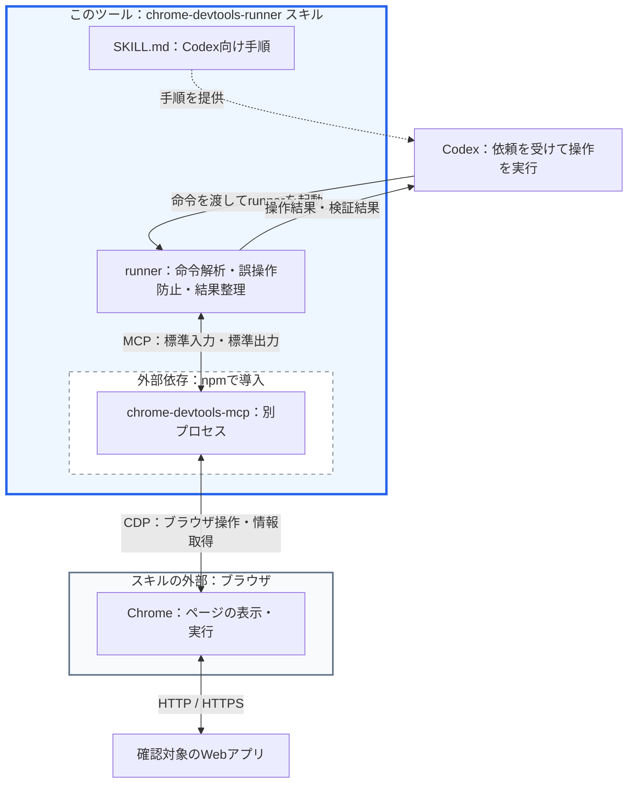
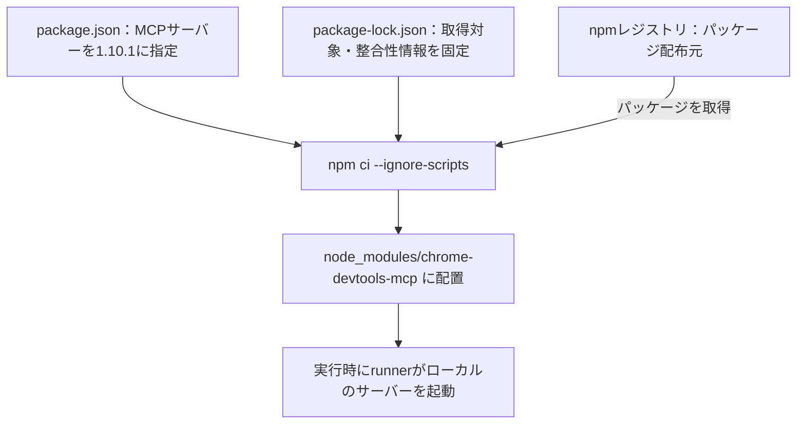
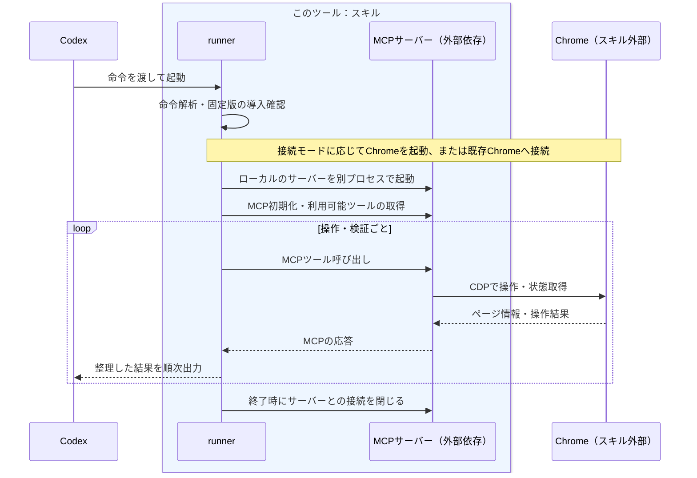
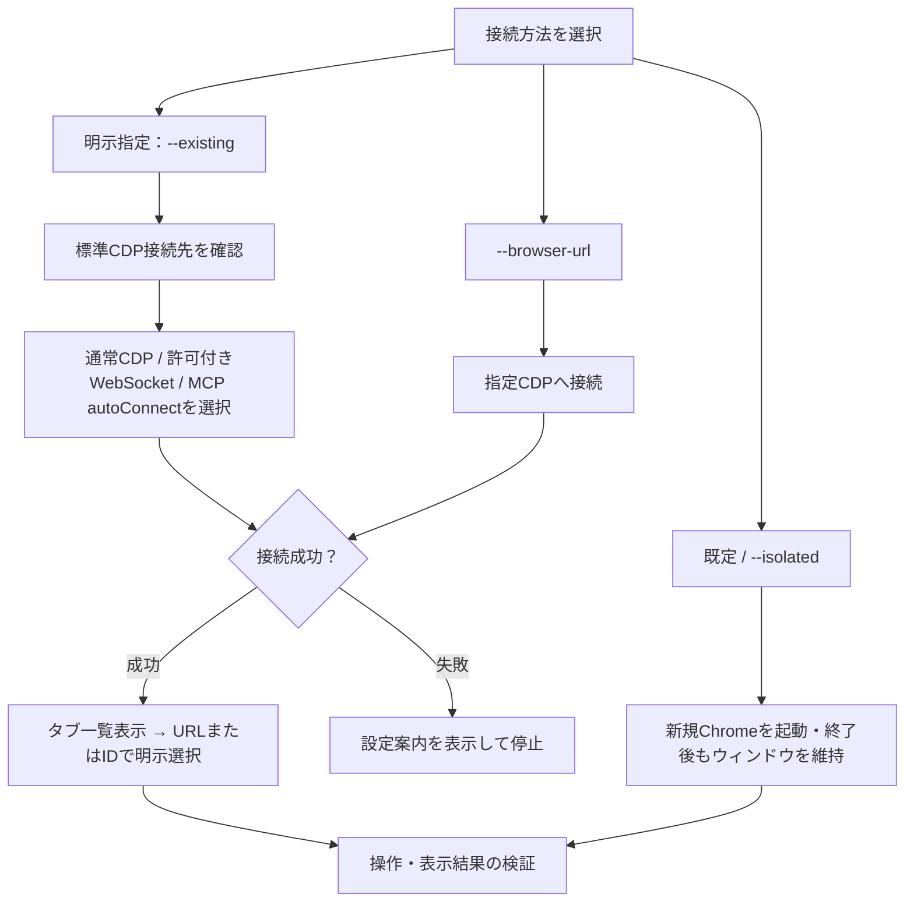

# Chrome DevTools Runner

Chrome DevTools MCP 経由で Chrome を操作し、画面遷移・入力・表示結果を検証する Codex skill / CLI です。

## Codexへの依頼方法（プロンプト例）

以下の文章をCodexに送って依頼できます。URLと確認内容は対象に合わせて置き換えてください。CLIのオプションを覚える必要はありません。

| 確認したいChrome | プロンプトでの指定 | 動作 |
|---|---|---|
| 新規Chrome（既定） | 「ブラウザで確認してください」または「新規Chromeで確認してください」 | 新しいプロセス・一時プロファイルで起動。Chrome側の手動設定は不要 |
| 起動済みChrome | **「起動済みChromeで確認してください」** | 既存のChromeへ接続。デバッグ有効化と接続許可が必要 |

どちらの場合も、確認後はChromeを開いたままにします。新規Chromeは普段のChromeのログイン状態を引き継ぎません。

### 新規Chromeで確認する場合（既定）

Chromeの指定を省略すると、新規Chromeで確認します。

```text
http://localhost:3000/login
上記URLのログイン画面をブラウザで確認してください。
```

新規起動を明示する場合も、次のように依頼できます。

```text
新規Chromeで http://localhost:3000/login を開き、
ID・パスワード入力欄とログインボタンが表示されることを確認してください。
```

スキルの導入が済んでいれば、Chrome側でリモートデバッグを手動設定する必要はありません。

### 起動済みChromeで確認する場合

**使いたいChromeが既に開いていることを、プロンプトで明示してください。** 明示がなければ新規Chromeが使われます。

```text
起動済みChromeで http://localhost:3000/items を開き、
一覧画面が表示されることを確認してください。
```

普段のChromeへ接続する際は、Codexから案内されるデバッグ有効化手順に従い、Chromeの接続確認を許可してください。設定済みであれば、接続先も添えると明確です。

```text
起動済みChromeで http://localhost:3000/items を確認してください。
リモートデバッグは有効です。
Server running at: 127.0.0.1:9222
```

「起動済みChrome」は新しいブラウザプロセスを起動する指定ではなく、既存のChromeに接続する指定です。対象ページのタブがない場合は、そのChrome内で新しいタブを開くことがあります。接続できない場合は設定手順を案内し、別のChromeには自動で切り替えません。詳細は[普段使っているChromeへ接続する](#普段使っているchromeへ接続する)を参照してください。

利用例として、ユーザーが先にログインしたChromeで、そのログイン状態を使って確認を依頼できます。

```text
起動済みChromeで http://localhost:3000/items を開いてください。
このChromeでは私がログイン済みです。
ログイン操作はせず、現在のログイン状態を使って一覧画面を確認してください。
ログイン画面に戻った場合は、私が再ログインするので知らせてください。
```

この流れなら、ID・パスワードをCodexへ渡す必要はありません。セッションが切れた場合はユーザーが再ログインしてから続きを依頼します。

前の確認でCodexが起動し、開いたままにしたChromeを続けて使う場合は、その旨を指定します。接続先が分かる場合は、前回表示された実際の値を添えてください。

```text
前回開いたままにした起動済みChromeで確認を続けてください。
接続先は http://127.0.0.1:<前回表示されたポート番号> です。
http://localhost:3000/items を開き、一覧画面を確認してください。
```

この検証用Chromeには起動時に接続設定が行われているため、動作中であれば手動でデバッグを有効にし直す必要はありません。

## 構成とつながり

このスキルは、Codex 向けの手順書とブラウザ操作用の runner をまとめたものです。runner は外部パッケージの `chrome-devtools-mcp` を別プロセスとして起動し、そのサーバーを通して Chrome を操作します。



**青い枠が、このツール（スキル）の配置範囲です。** Codex と Chrome の間に位置し、命令をブラウザ操作へつなぎ、結果を Codex に返します。Chrome は独立した外部プログラムとして、スキルの枠外に示しています。

枠内の `chrome-devtools-mcp` は、このツール独自の実装ではなく、`node_modules` に導入する外部依存です。点線の枠で区別しています。この図の枠は配置・構成上の区分であり、OSのプロセス境界やセキュリティ境界を示すものではありません。

この図は、この runner を使う場合の構成です。MCP 通信を行うクライアント処理は runner 内に実装しています。MCP と CDP は通信規約であり、それ自体がインストールするプログラムの名称ではありません。

| 構成要素 | 役割・配置 |
|---|---|
| スキル | `SKILL.md`、runner、手順書、テストなどの一式。Codex が実行方法を判断するための情報と実行手段を提供します。 |
| Codex | ユーザーの依頼とスキルの手順から操作命令を組み立て、runner の結果を確認して報告します。 |
| runner | `scripts/chrome-devtools-runner.js`。命令解析、対象の特定、曖昧な操作の拒否、入力値のマスク、結果出力を担当します。 |
| Node.js | runner と MCP サーバーの JavaScript を実行する環境です。別途インストールします。 |
| npm | MCP サーバーをパッケージとして取得するためのツールです。通常の runner 起動時に再ダウンロードするものではありません。 |
| MCP | Model Context Protocol。runner がサーバーのツールを呼び出し、結果を受け取る通信規約です。この構成では標準入力・標準出力を使います。 |
| chrome-devtools-mcp | npm パッケージとして配布される MCP サーバープログラム。スキル配下の `node_modules` に導入し、runner とは別プロセスで起動します。 |
| CDP | Chrome DevTools Protocol。タブ操作、JavaScript 実行、画面情報取得などを外部から行うために Chrome が提供する通信規約です。 |
| Chrome | 実際にページを表示・実行するブラウザです。MCP サーバーは Chrome に内蔵されていません。 |
| 確認対象のWebアプリ | Chrome がアクセスするアプリケーション。ローカル環境でもリモート環境でも確認できます。 |

### 導入時の流れとバージョン固定

`chrome-devtools-mcp` は、このスキルで利用するためにダウンロードする外部プログラムです。runner がライブラリの関数を直接呼ぶ形式ではなく、インストール済みのサーバーを起動して通信します。



```text
chrome-devtools-runner/
├── SKILL.md                         # Codex向けの手順
├── README.md                        # 構成・導入・操作方法
├── scripts/chrome-devtools-runner.js # runnerとMCPクライアント処理
├── package.json                     # 使用するMCPサーバーのバージョン
├── package-lock.json                # インストール内容の固定
└── node_modules/                    # npm ciで生成。Git管理対象外
    └── chrome-devtools-mcp/          # 外部のMCPサーバープログラム
```

以前の `npx -y chrome-devtools-mcp@latest` では、実行時期によって別のバージョンが使われる可能性がありました。現在は検証済みの **1.10.1** を使用し、サーバー更新による引数・返却形式の予期しない変化を防ぎます。更新するときは package と lock を一緒に変更し、回帰テストで確認します。

固定対象は MCP サーバーのパッケージです。Chrome 本体は固定せず、Node.js は対応バージョン範囲を指定しています。実行環境全体を完全に固定するものではありません。明示的に `--server-command` などでサーバーを差し替えた場合は、この固定チェックの対象外です。

### 実行時の流れ



1つの命令で、対象の検索・操作・結果確認のために複数回のツール呼び出しが発生することがあります。エラー時は後続の命令を停止し、取得できた診断情報を返します。

`http://127.0.0.1:9222` は、既存 CDP モードなどで使う **Chrome の操作用接続先**です。`http://localhost:3000/login` などの **確認対象ページのURL**とは用途が異なります。既存Chromeの自動接続モードと独立Chromeモードでは、利用者がこのポートを指定する必要はありません。各モードで誰が Chrome を起動するかは、次の「ブラウザ接続」を参照してください。

## 導入

Google Chrome と Node.js `^20.19.0 || ^22.12.0 || >=23`、npm が必要です。検証環境は macOS / Node.js 24.15.0 です。

```sh
cd ~/.codex/skills/chrome-devtools-runner
npm ci --ignore-scripts
```

プロジェクト配下に配置した場合は、その skill ディレクトリで実行してください。依存取得時にはネットワーク接続が必要です。通常起動ではローカルに導入した **chrome-devtools-mcp 1.10.1** を使い、自動ダウンロード・自動更新はしません。依存は `package-lock.json` で固定しています。未導入やバージョン不一致は、ブラウザ起動前にエラーになります。

以下の例はこのディレクトリを作業ディレクトリとしています。別の場所からは `scripts/chrome-devtools-runner.js` を絶対パスで指定してください。ルートの shim は不要です。

## ブラウザ接続

**既定は一時プロファイルの新規Chromeです。** 手動でデバッグを有効化する必要はなく、必要な起動設定をツールが指定します。普段のChromeは、明示的に `--existing` などを指定した場合だけ利用します。既存Chromeへの接続に失敗しても、別のChromeを自動で起動しません。

| モード | 指定 | 接続・起動の動作 |
|---|---|---|
| 既存Chrome | `--existing` | 標準CDP接続先を確認し、利用できなければMCPの `--autoConnect` でChrome stableを検出 |
| 既存CDP | `--browser-url http://127.0.0.1:9222` | 指定したCDP接続先へ接続。新しいChromeは起動しない |
| WebSocket指定 | `--ws-endpoint ws://127.0.0.1:9222/devtools/browser` | 指定したブラウザWebSocketへ接続。Chrome側の接続許可は維持 |
| 独立Chrome（既定） | 指定なし、または `--isolated` | runnerが一時プロファイルの新規Chromeを起動し、終了後も残す。普段のログイン状態は引き継がない |
| CDP起動補助（従来互換） | `--ensure-cdp` | 指定CDPに接続し、接続できなければChromeを起動 |



### 普段使っているChromeへ接続する

ユーザーが既存Chromeでの確認を明示した場合に利用します。実行前に、以下のデバッグ有効化と接続許可の手順を案内してください。

1. Chrome 144以降のstable版を起動する。
2. Chromeで `chrome://inspect/#remote-debugging` を開き、リモートデバッグを有効にする。
3. runnerを実行し、Chromeに接続確認が表示された場合は許可する。

```sh
node scripts/chrome-devtools-runner.js --existing "list tabs"
node scripts/chrome-devtools-runner.js --existing "switch tab http://localhost:3000/login then read page"
```

`--existing` は既定で `127.0.0.1:9222` の `/json/version` を確認します。通常CDPならHTTP接続先を使い、ローカル接続先が404を返す場合はChromeの許可付きモードとして `/devtools/browser` のWebSocketで接続を試みます。検出できなければMCPの `--autoConnect` を使用します。ポートを変えている場合は `--cdp-port`、接続先が分かる場合は `--browser-url` または `--ws-endpoint` を指定できます。接続要求が拒否・失敗した後に別方式で再試行することはありません。

Chromeの設定画面でサーバー稼働中と表示されていても、許可付きモードではHTTPの情報取得が404になる場合があります。これは設定不備とは限りません。`--existing` または明示的な `--ws-endpoint` を利用してください。許可付きWebSocketはChromeの承認処理を経由します（[Chromium実装](https://chromium.googlesource.com/chromium/src/+/main/content/browser/devtools/devtools_http_handler.cc)）。

設定はrunnerから変更しません。Chromeが起動していない・設定が無効・接続が許可されない場合は停止して確認箇所を案内します。Chromeによっては接続のたびに確認が必要です。詳細は [Chrome公式の接続説明](https://developer.chrome.com/blog/chrome-devtools-mcp-debug-your-browser-session?hl=ja) を参照してください。

### 接続先と操作対象を確認する

起動時に `[browser] mode=... target=...` を出力します。既存Chromeでは実際のタブ一覧も表示し、runnerの操作対象は未選択で開始します。一覧の `*` はブラウザ側の選択状態であり、runnerが操作を許可した対象という意味ではありません。

既存Chromeでは、読み取り・入力・遷移などの前に **`switch tab <完全なURLまたは数値ID>`** が必要です。URLが複数タブに一致する場合は停止するため、タブIDを指定してください。`current` / `first` / `last` やURLの部分一致では選択できません。選択結果にはタブID・タイトル・URLを表示します。

```sh
node scripts/chrome-devtools-runner.js --browser-url http://127.0.0.1:9222 "list tabs then switch tab 1 then read page"
```

再接続時は毎回明示選択が必要です。`new tab URL` で作成した場合も、その後に `list tabs` と `switch tab` で対象を選択します。タブを閉じた後は、次の操作前に選択し直してください。選択したタブへの遷移が失敗しても、別タブに切り替えて再試行しません。

### 独立したChromeを使う

```sh
node scripts/chrome-devtools-runner.js --isolated "open http://localhost:3000/login then read page"
```

新規検証や既存のログイン状態を使わない確認向けです。runnerがChromeを別プロセスで起動し、確認終了後もウィンドウを残します。閉じる場合はChromeのウィンドウを手動で閉じてください。再接続には出力された `--browser-url` と明示的なタブ選択を使用できます。一時プロファイルは再接続用に残し、自動削除しません。`--existing` / `--isolated` は併用できず、`--isolated` と `--browser-url` / `--ws-endpoint`、明示モードと `--ensure-cdp` / カスタムサーバー指定 / 永続プロファイル指定も併用できません。

### 従来のCDP起動補助

`--ensure-cdp` は従来どおり利用できます。新規起動時は一時プロファイルを使い、Chromeはrunner終了後も残ります。状態を保存する場合は `--chrome-user-data-dir PATH --reuse-chrome-profile` を指定します。このモードには既存モードのタブ明示選択制約を適用しないため、既存ブラウザの確認には `--existing` または `--browser-url` を優先してください。

**指定なし実行は新規プロセス・一時プロファイルで起動します。** 普段のChromeの設定変更は不要です。Node.js・Chromeの導入と、スキルの `npm ci --ignore-scripts` は必要です。明示的な `--server-command` / `MCP_SERVER_COMMAND` は従来どおりそのコマンドで接続・起動し、新しいモードの制約対象外です。

## 操作と検証

命令は `then`、`and`、`、` で連結できます。空白を含む対象名や区切り語を含む値は引用符で囲みます。引用符内の引用符とバックスラッシュはバックスラッシュでエスケープします。

```sh
node scripts/chrome-devtools-runner.js --isolated 'open http://localhost:3000 then type "Login ID" "bread and butter、東京" then submit form #login then wait url /dashboard then expect text Dashboard'
node scripts/chrome-devtools-runner.js --existing 'switch tab http://localhost:3000 then set viewport mobile then read viewport then snapshot'
```

| 種類 | 命令例 |
|---|---|
| 遷移 | `open URL`, `back`, `forward`, `reload` |
| タブ | `new tab URL`, `list tabs`, `switch tab URL`, `close tab ID` |
| 操作 | `click 保存`, `type "Login ID" "value"`, `submit form #login`, `press Enter` |
| 取得 | `title`, `read page`, `snapshot` |
| 待機・検証 | `wait text`, `wait url /path`, `wait text gone Loading`, `expect text 完了`, `expect url /path`, `expect title タイトル` |
| 画面幅 | `set viewport mobile`, `set viewport 1280x720`, `read viewport` |
| ダイアログ | `accept dialog`, `dismiss dialog` |
| JavaScript | `eval () => document.title` |

ラベルが複数に一致した場合は停止します。新しい snapshot の `uid:<ID>` や一意な CSS セレクタで対象を特定してください。`submit` はフォーカス中のフォーム、またはページ内で唯一のフォームを対象とします。明示した対象が存在しない・複数ある・入力検証に失敗する場合、別のフォームへフォールバックしません。

クリック成功だけでは遷移成功の証明にはなりません。`wait` / `expect` で結果を確認してください。新しいタブが開いた場合は `list tabs` → `switch tab` → 検証の順に操作します。

## 秘密値と出力

認証情報はコマンド引数やシェル履歴に埋め込まず、信頼できる入力元から `--stdin` に渡してください。標準入力と命令引数は併用できません。

```sh
node scripts/chrome-devtools-runner.js --isolated --stdin
```

全入力値を操作要約から除外し、同じ実行中に出力へ現れた入力値もマスクします。`--debug` は MCP の生ペイロード・標準エラーを表示しません。既存のページ情報や Chrome / MCP が保存するファイル全体を匿名化する機能ではありません。

各操作は `[1/N] succeeded ...` / `failed ...` と所要時間を順次出力します。失敗後は後続操作を実行せず、完了済みの結果を保持します。

- `--full`: 取得したテキスト・要素を省略せず表示。
- `--filter TEXT --offset N --limit N`: 要素を大文字小文字を区別しない文字列で絞り込み、ページング。本文にはフィルタを適用しません。
- `--text-limit N`: 本文プレビューの文字数。
- `--output /tmp/new-report.json`: 各操作後に JSON レポートを更新。既存ファイルは拒否し、新規ファイルは所有者のみ読み書き可能にします。

診断情報はページ・snapshot・console ごとに `ok` / `unavailable` / `failed` を区別します。診断要求は各1.5秒で打ち切り、元のエラーを保持します。診断取得失敗を理由に送信・更新操作を繰り返さないでください。

## 詳細設定

`--timeout MS`、`--show-tools`、`--show-tool-schemas`、`--debug` が利用できます。CDP 起動には `--cdp-host`、`--cdp-port`、`--cdp-startup-timeout`、`--chrome-path`、`--chrome-log-file` を指定できます。引数なしの実行でオプション一覧を表示します。

`--server-command COMMAND` または `MCP_SERVER_COMMAND` でサーバーを差し替えられます。この場合はローカル依存の固定チェック対象外となります。信頼できるコマンドのみ指定してください。

## 開発・保守

```sh
npm run check
npm test
npm run test:browser
```

`npm test` は Chrome・外部サイトへの接続不要です。`test:browser` はインストール済み Chrome を独立した一時プロファイルで起動し、同梱 HTML のみを操作します。`MCP_SERVER_COMMAND` は解除して実行してください。既存のログイン済みブラウザは操作しません。

検証範囲、バージョン更新、障害の切り分けは [保守手順](references/usage-notes.md)、Codex の操作方針は [SKILL.md](SKILL.md) を参照してください。
