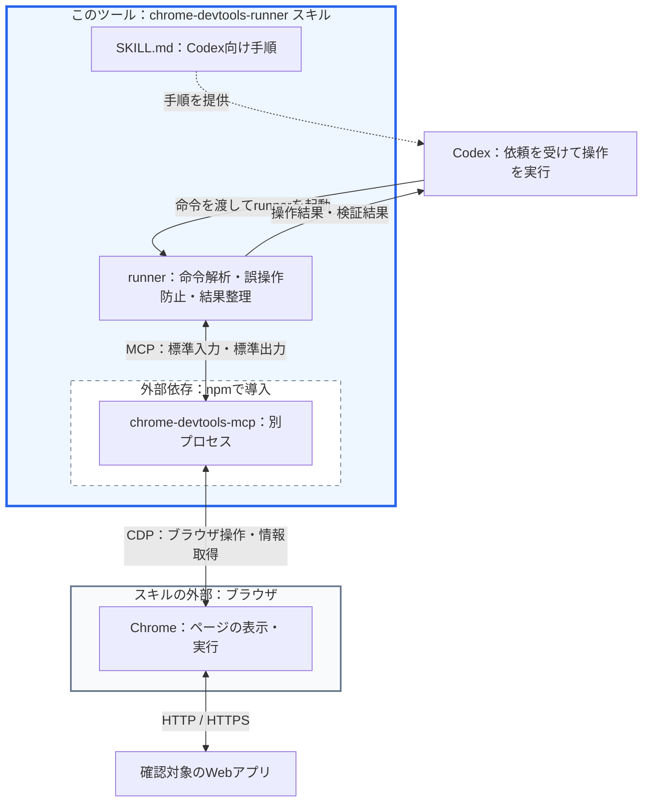
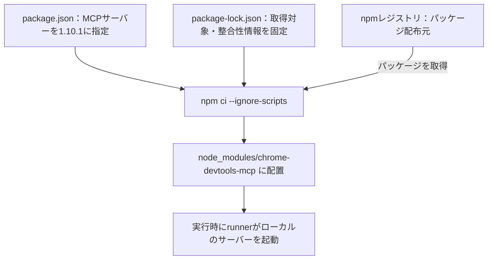
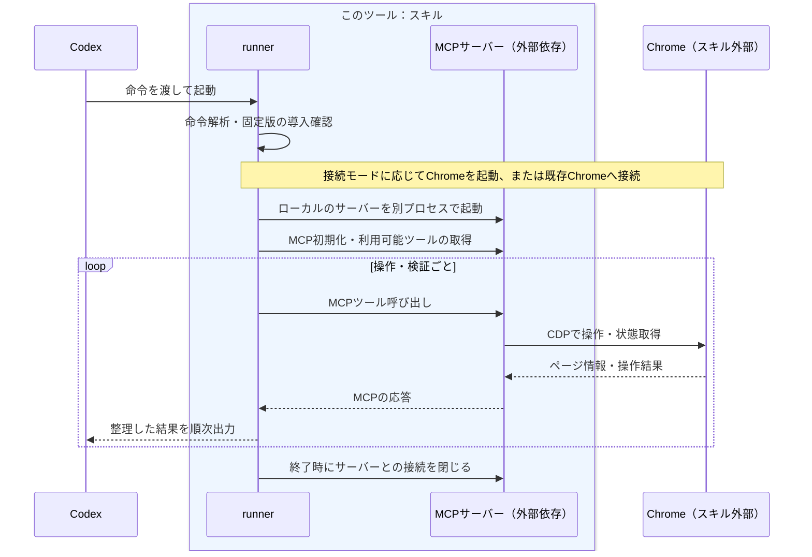

# Chrome DevTools Runner

Chrome DevTools MCP 経由で Chrome を操作し、画面遷移・入力・表示結果を検証する Codex skill / CLI です。

## 構成とつながり

このスキルは、Codex 向けの手順書とブラウザ操作用の runner をまとめたものです。runner は外部パッケージの `chrome-devtools-mcp` を別プロセスとして起動し、そのサーバーを通して Chrome を操作します。



**青い枠が、このツール（スキル）の配置範囲です。** Codex と Chrome の間に位置し、命令をブラウザ操作へつなぎ、結果を Codex に返します。Chrome は独立した外部プログラムとして、スキルの枠外に示しています。

枠内の `chrome-devtools-mcp` は、このツール独自の実装ではなく、`node_modules` に導入する外部依存です。点線の枠で区別しています。この図の枠は配置・構成上の区分であり、OSのプロセス境界やセキュリティ境界を示すものではありません。

この図は、この runner を使う場合の構成です。MCP 通信を行うクライアント処理は runner 内に実装しています。MCP と CDP は通信規約であり、それ自体がインストールするプログラムの名称ではありません。

| 構成要素 | 役割・配置 |
|---|---|
| スキル | `SKILL.md`、runner、手順書、テストなどの一式。Codex が実行方法を判断するための情報と実行手段を提供します。 |
| Codex | ユーザーの依頼とスキルの手順から操作命令を組み立て、runner の結果を確認して報告します。 |
| runner | `scripts/chrome-devtools-runner.js`。命令解析、対象の特定、曖昧な操作の拒否、入力値のマスク、結果出力を担当します。 |
| Node.js | runner と MCP サーバーの JavaScript を実行する環境です。別途インストールします。 |
| npm | MCP サーバーをパッケージとして取得するためのツールです。通常の runner 起動時に再ダウンロードするものではありません。 |
| MCP | Model Context Protocol。runner がサーバーのツールを呼び出し、結果を受け取る通信規約です。この構成では標準入力・標準出力を使います。 |
| chrome-devtools-mcp | npm パッケージとして配布される MCP サーバープログラム。スキル配下の `node_modules` に導入し、runner とは別プロセスで起動します。 |
| CDP | Chrome DevTools Protocol。タブ操作、JavaScript 実行、画面情報取得などを外部から行うために Chrome が提供する通信規約です。 |
| Chrome | 実際にページを表示・実行するブラウザです。MCP サーバーは Chrome に内蔵されていません。 |
| 確認対象のWebアプリ | Chrome がアクセスするアプリケーション。ローカル環境でもリモート環境でも確認できます。 |

### 導入時の流れとバージョン固定

`chrome-devtools-mcp` は、このスキルで利用するためにダウンロードする外部プログラムです。runner がライブラリの関数を直接呼ぶ形式ではなく、インストール済みのサーバーを起動して通信します。



```text
chrome-devtools-runner/
├── SKILL.md                         # Codex向けの手順
├── README.md                        # 構成・導入・操作方法
├── scripts/chrome-devtools-runner.js # runnerとMCPクライアント処理
├── package.json                     # 使用するMCPサーバーのバージョン
├── package-lock.json                # インストール内容の固定
└── node_modules/                    # npm ciで生成。Git管理対象外
    └── chrome-devtools-mcp/          # 外部のMCPサーバープログラム
```

以前の `npx -y chrome-devtools-mcp@latest` では、実行時期によって別のバージョンが使われる可能性がありました。現在は検証済みの **1.10.1** を使用し、サーバー更新による引数・返却形式の予期しない変化を防ぎます。更新するときは package と lock を一緒に変更し、回帰テストで確認します。

固定対象は MCP サーバーのパッケージです。Chrome 本体は固定せず、Node.js は対応バージョン範囲を指定しています。実行環境全体を完全に固定するものではありません。明示的に `--server-command` などでサーバーを差し替えた場合は、この固定チェックの対象外です。

### 実行時の流れ



1つの命令で、対象の検索・操作・結果確認のために複数回のツール呼び出しが発生することがあります。エラー時は後続の命令を停止し、取得できた診断情報を返します。

`http://127.0.0.1:9222` は、既存 CDP モードなどで使う **Chrome の操作用接続先**です。`http://localhost:3000/login` などの **確認対象ページのURL**とは用途が異なります。MCP 管理モードでは、利用者がこのポートを指定する必要はありません。各モードで誰が Chrome を起動するかは、次の「ブラウザ接続」を参照してください。

## 導入

Google Chrome と Node.js `^20.19.0 || ^22.12.0 || >=23`、npm が必要です。検証環境は macOS / Node.js 24.15.0 です。

```sh
cd ~/.codex/skills/chrome-devtools-runner
npm ci --ignore-scripts
```

プロジェクト配下に配置した場合は、その skill ディレクトリで実行してください。依存取得時にはネットワーク接続が必要です。通常起動ではローカルに導入した **chrome-devtools-mcp 1.10.1** を使い、自動ダウンロード・自動更新はしません。依存は `package-lock.json` で固定しています。未導入やバージョン不一致は、ブラウザ起動前にエラーになります。

以下の例はこのディレクトリを作業ディレクトリとしています。別の場所からは `scripts/chrome-devtools-runner.js` を絶対パスで指定してください。ルートの shim は不要です。

## ブラウザ接続

| モード | 指定 | 用途 |
|---|---|---|
| MCP 管理 | 指定なし | MCP が Chrome を起動・管理 |
| 既存 CDP | `--browser-url http://127.0.0.1:9222` | 起動済みブラウザへ接続 |
| CDP 起動補助 | `--ensure-cdp` | 接続先がなければ Chrome を起動 |

```sh
node scripts/chrome-devtools-runner.js --ensure-cdp "open http://localhost:3000/login then read page"
node scripts/chrome-devtools-runner.js --browser-url http://127.0.0.1:9222 "list tabs then switch tab http://localhost:3000/login then snapshot"
```

既存ブラウザへ再接続したら、URL または ID でタブを明示的に選択します。前回選択したタブの継続を前提にしません。`--ensure-cdp` は新規起動時に一時プロファイルを使います。状態を保存する必要がある場合だけ `--chrome-user-data-dir PATH --reuse-chrome-profile` を指定します。

## 操作と検証

命令は `then`、`and`、`、` で連結できます。空白を含む対象名や区切り語を含む値は引用符で囲みます。引用符内の引用符とバックスラッシュはバックスラッシュでエスケープします。

```sh
node scripts/chrome-devtools-runner.js --ensure-cdp 'open http://localhost:3000 then type "Login ID" "bread and butter、東京" then submit form #login then wait url /dashboard then expect text Dashboard'
node scripts/chrome-devtools-runner.js --ensure-cdp 'switch tab http://localhost:3000 then set viewport mobile then read viewport then snapshot'
```

| 種類 | 命令例 |
|---|---|
| 遷移 | `open URL`, `back`, `forward`, `reload` |
| タブ | `new tab URL`, `list tabs`, `switch tab URL`, `close tab ID` |
| 操作 | `click 保存`, `type "Login ID" "value"`, `submit form #login`, `press Enter` |
| 取得 | `title`, `read page`, `snapshot` |
| 待機・検証 | `wait text`, `wait url /path`, `wait text gone Loading`, `expect text 完了`, `expect url /path`, `expect title タイトル` |
| 画面幅 | `set viewport mobile`, `set viewport 1280x720`, `read viewport` |
| ダイアログ | `accept dialog`, `dismiss dialog` |
| JavaScript | `eval () => document.title` |

ラベルが複数に一致した場合は停止します。新しい snapshot の `uid:<ID>` や一意な CSS セレクタで対象を特定してください。`submit` はフォーカス中のフォーム、またはページ内で唯一のフォームを対象とします。明示した対象が存在しない・複数ある・入力検証に失敗する場合、別のフォームへフォールバックしません。

クリック成功だけでは遷移成功の証明にはなりません。`wait` / `expect` で結果を確認してください。新しいタブが開いた場合は `list tabs` → `switch tab` → 検証の順に操作します。

## 秘密値と出力

認証情報はコマンド引数やシェル履歴に埋め込まず、信頼できる入力元から `--stdin` に渡してください。標準入力と命令引数は併用できません。

```sh
node scripts/chrome-devtools-runner.js --ensure-cdp --stdin
```

全入力値を操作要約から除外し、同じ実行中に出力へ現れた入力値もマスクします。`--debug` は MCP の生ペイロード・標準エラーを表示しません。既存のページ情報や Chrome / MCP が保存するファイル全体を匿名化する機能ではありません。

各操作は `[1/N] succeeded ...` / `failed ...` と所要時間を順次出力します。失敗後は後続操作を実行せず、完了済みの結果を保持します。

- `--full`: 取得したテキスト・要素を省略せず表示。
- `--filter TEXT --offset N --limit N`: 要素を大文字小文字を区別しない文字列で絞り込み、ページング。本文にはフィルタを適用しません。
- `--text-limit N`: 本文プレビューの文字数。
- `--output /tmp/new-report.json`: 各操作後に JSON レポートを更新。既存ファイルは拒否し、新規ファイルは所有者のみ読み書き可能にします。

診断情報はページ・snapshot・console ごとに `ok` / `unavailable` / `failed` を区別します。診断要求は各1.5秒で打ち切り、元のエラーを保持します。診断取得失敗を理由に送信・更新操作を繰り返さないでください。

## 詳細設定

`--timeout MS`、`--show-tools`、`--show-tool-schemas`、`--debug` が利用できます。CDP 起動には `--cdp-host`、`--cdp-port`、`--cdp-startup-timeout`、`--chrome-path`、`--chrome-log-file` を指定できます。引数なしの実行でオプション一覧を表示します。

`--server-command COMMAND` または `MCP_SERVER_COMMAND` でサーバーを差し替えられます。この場合はローカル依存の固定チェック対象外となります。信頼できるコマンドのみ指定してください。

## 開発・保守

```sh
npm run check
npm test
npm run test:browser
```

`npm test` は Chrome・外部サイトへの接続不要です。`test:browser` はインストール済み Chrome を独立した一時プロファイルで起動し、同梱 HTML のみを操作します。`MCP_SERVER_COMMAND` は解除して実行してください。既存のログイン済みブラウザは操作しません。

検証範囲、バージョン更新、障害の切り分けは [保守手順](references/usage-notes.md)、Codex の操作方針は [SKILL.md](SKILL.md) を参照してください。
